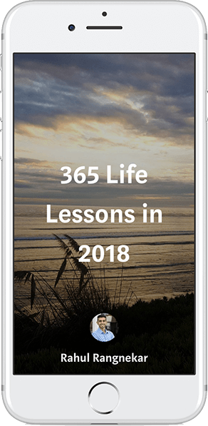

# 365 Lessons

[Go To Series](https://medium.com/series/365-life-lessons-in-2018-5c86116f7929)

Reflecting back on 2017, many days and weeks went by in which I did not learn something new about life or about myself.

I started this Medium series to track and find a deeper meaning in my days throughout 2018. If I know I will have to write about a lesson I learned in the night, I will spend my day more aware of my actions, thoughts, and surroundings. I am encouraged to reflect on my day to find a lesson I deem meaningful, however minor or major, and I will be able to look back on this record with positivity.