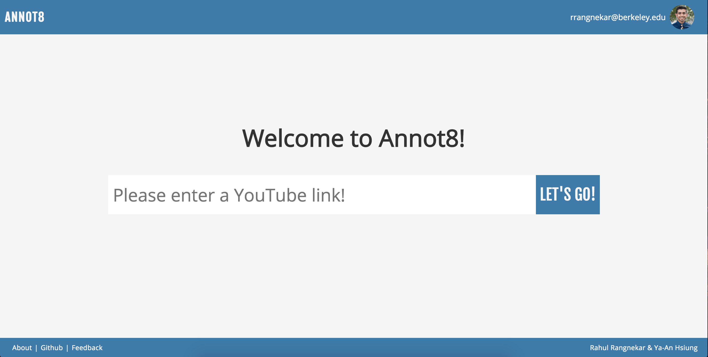
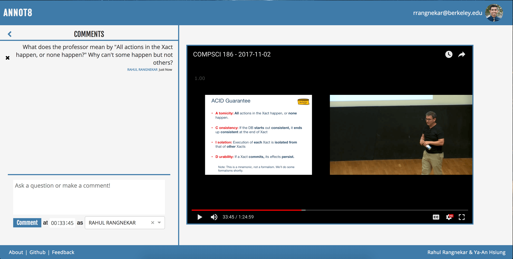
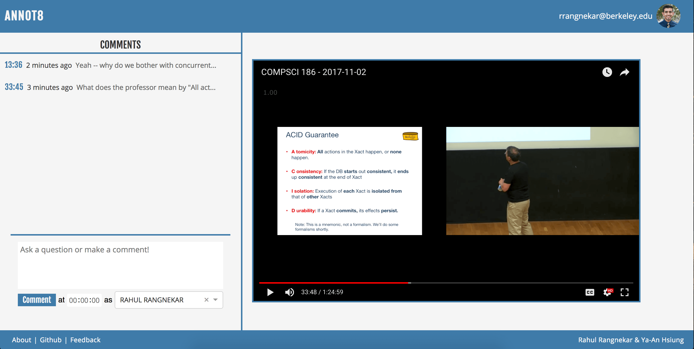
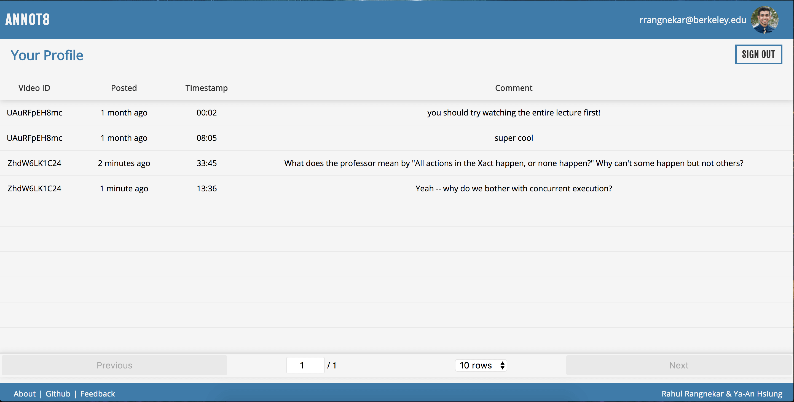

# Annot8

[Go To Project](http://annot8.net)

Students face busy lives. We strive to keep up with our academics as we recruit for jobs and internships, maintain our mental and physical health, lead an active social life, participate in clubs and organizations, and work on personally-fulfilling side projects. It is tough to do it all, and so we often skip lectures for classes at inconvenient times to do tend to more pressing matters.

Luckily, a significant number of our classes have lectures that are recorded and uploaded to YouTube within the day, giving us the option to watch (or re-watch) lecture in our own time. Unfortunately, however, Berkeley disallows comments on its YouTube videos so that it does not have to filter comments for spam or harassment.

This puts students in a predicament if they have questions about something the professor said or confusing material covered in lecture. There is no convenient place to ask - it is troublesome to link to a video at a timestamp using the otherwise-amazing platform Piazza. Office hours with the professor or TAs are too few and too packed to receive proper guidance. And if the material is necessary for an assignment, students have nowhere else to turn to get answers.

**This is where Annot8 comes in.**

The home page of Annot8 - enter a URL and go!

Annot8 is a platform for students to ask questions on webcasted YouTube lecture videos. Students simply download our Google Chrome Extension (to be launched in the Chrome Extension store in the near future), navigate to their lecture video on YouTube, click on the extension, and redirect to Annot8.

As students watch the video, they can ask questions at certain timestamps or respond to others’ comments. Students can also choose to comment anonymously, as they may not want their identity known.

students can comment at specific timestamps

students can see all timestamps at which comments were made

All comments are stored in a MongoDB database hosted via mLab. There are two “collections” (tables for non-relational database structures) — one to store Users and another to store Comments. Comments are stored with:
1. the video ID — unique to each YouTube video — on which the Comment was made,
2. the timestamp at which the User made the Comment,
3. the name of the User who made the Comment,
4. whether or not the User chose to post anonymously — in which case “Anonymous” is rendered beneath their Comment rather than their name,
5. the ID of the User — unique to each User in the Users collection, and 
6. the Comment text itself

Each User in stored with:
1. their name,
2. their email, 
3. their Google ID — an alphanumeric value unique to their Google account, used to authenticate the user upon signing into Annot8, and 
4. the profile picture linked to their Google account

The profile page — users can see all comments they’ve made, and can click through to a specific comment on a video

This application was built with React JS with Redux on the front-end and Node JS on the back-end. User authentication is handled via PassportJS.

