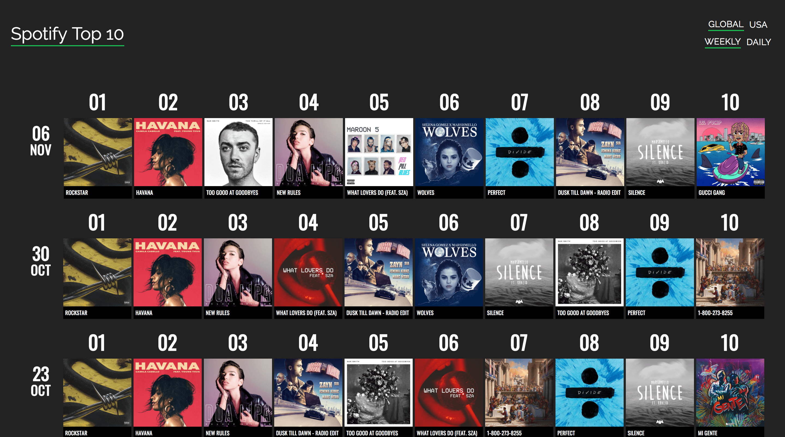
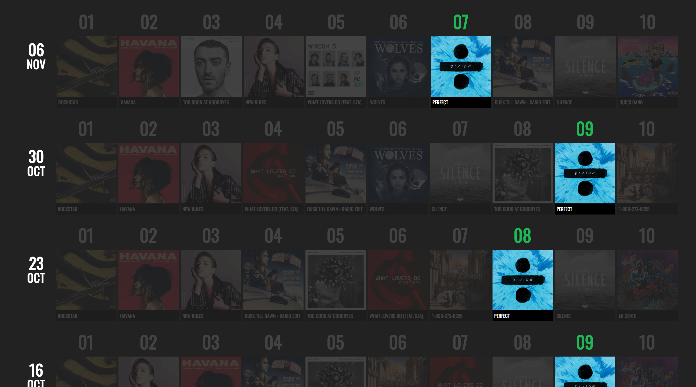
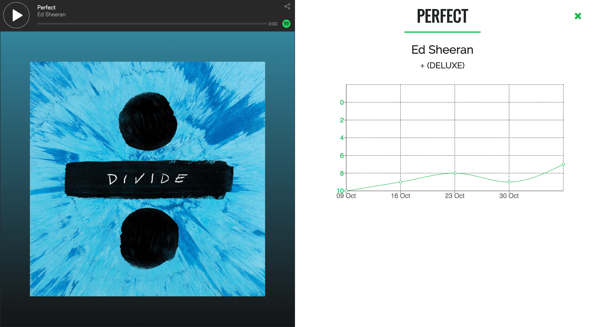

# Spotify Top 10

The landing page - top 10 songs of the week

Soon after finishing my summer 2017 internship, I wanted to practice my newly-learned React skills with projects using corporate data. As a Spotify Premium listener, I decided to try my hand at the Spotify API.

To gather data necessary for the visualizations, I wrote two scripts:

1. `data_grabber.js` this script queried the Spotify API for the top 10 tracks on the __USA Top 50__ and __Global Top 50__ charts, storing the data in json files organized by date (e.g. `01\_08\_17.json`).
2. `rank_collector.js` this script parses the date files, storing the rank (1, 2, ..., 10) of a track in a given week by the unique key of the track (e.g. `7wGoVu4Dady5GV0Sv4UIsx.json` refers to __Rockstar__ by Post Malone).

This json data is loaded into a Redux store. Track cards are generated by mapping over this data. When a user hovers over a track card, all cards with the same aforementioned unique track key remain opaque while all other cards become almost fully transparent. This affords a user the ability to see the rank of a track over time.

The tracking system, visualized

More information about the track, as well as another form of visualized tracking, is available when a track card is clicked.

The data for each track