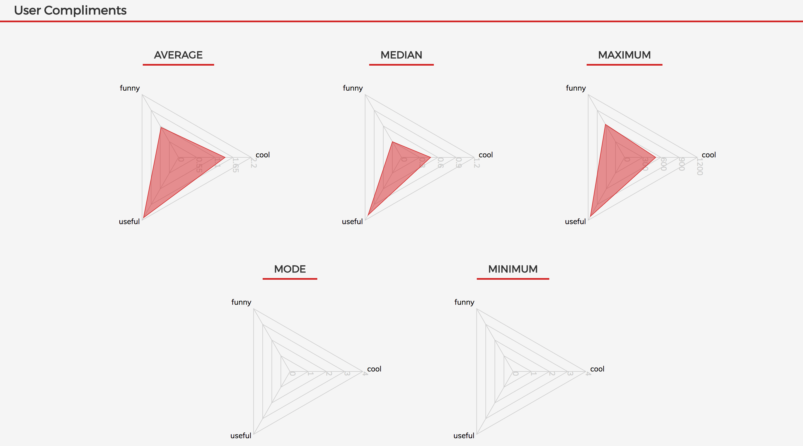
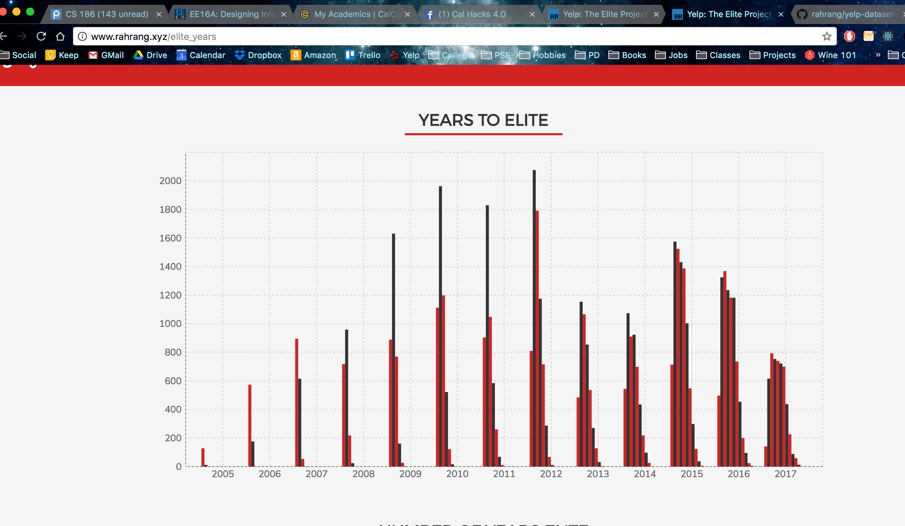

# The Yelp Elite Project

I was inducted into the Yelp Elite Program this past summer. I spent A LOT of time discovering and writing reviews for restaurants in SoCal, Berkeley and San Francisco, and even Chicago. Throughout the latter half of July, I challenged myself to write at least 3 review per day to try to earn Yelp Elite by my 21st birthday in early August. With 85 reviews on my profile, I received my Elite offer a few weeks after my birthday. When the school year started, I learned about the Yelp public dataset as I recruited (and still am recruiting) for a full-time job in product management or software engineering.

As an avid Yelp user and Elite member, I wanted to find out what made me special. Where did I fit in on the spectrum of other Elite users? Was I really qualified, or was it a fluke? 
In addition, I wanted to shed light on the statistics necessary (i.e. how many reviews are required, what is the average review length, etc.) to have a shot at becoming Elite.

I used Python to clean and aggregate the Yelp dataset. This practice helped me better understand commands used to interact with my file system via Python, as well as a lot about program efficiency. The Yelp dataset included over 1.1 million users and 10 million reviews. This filtered down to around 40 thousand __elite__ users and 1.1 million __elite__ reviews. To parse through all reviews or to find associations between these two datasets required writing efficient code.

I build the front-end of this project in React and Redux. When the app launches, it loads all data from json files into a redux store. The data is then passed through Recharts graph components to render the data visually.

This project piqued my interest in using data along with software development, as well as cleaning it to better understand the __meaning__ of the data itself. I encountered a few problems in deciding the types of graphs to use - I tried to use a scatterplot to display the association between the number of Elite users and their corresponding number of reviews, but received data points everywhere. Furthermore, passing too much data (around 40K data points) into a graph component made loading the website impossible - my browser crashed and I was left brainstorming a different way to visually display insights.

Overall, I enjoyed working through this project!

The number of Elite reviews.

Compliments given to Elite reviews.

The number of users inducted into Elite.

The breakdown for number of users inducted to Elite in a given year.