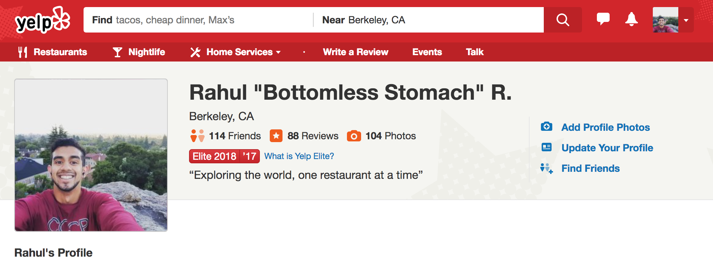

# Yelp Elite

Berkeley and San Francisco both have amazing food scenes. I spent close to 3 years exploring these restaurants.

In the summer of 2017, I wanted to make it into the Yelp Elite program by my 21st birthday in August.

I started out writing reviews on Yelp, but that wasn't enough. Most of the time, I was writing about food and tastes I had eaten weeks (and sometimes months) ago - things I couldn't remember.

And so my reviews turned into stories about my __experience__ at these restaurants. The reviews became a way for me to express myself, work on my storytelling skills, and enjoy a hobby (eating) I hold very close to my heart (and stomach). Furthermore with a pescatarian diet, I felt I could offer a new take on restaurants and foods not generally reviewed.

And so a few weeks after my 21st birthday, I became Elite!

I continue to review restaurants - my most recent ones are those I visited in Italy - and write about my experiences!